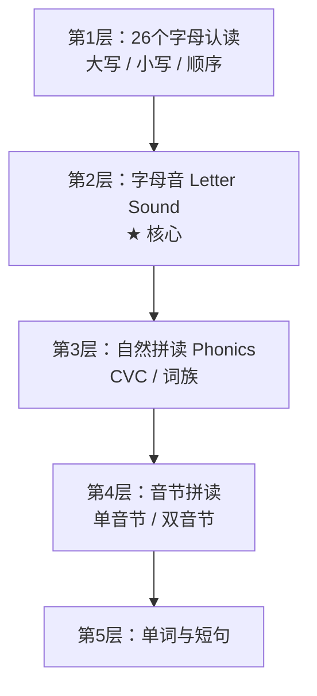

# 二年级英语学习 H5 系统 — 系统设计文档

> 版本：v1.0
> 目标用户：二年级小学生（7-8岁）
> 载体：H5（移动端浏览器 / 微信内打开）
> 学习路径：字母 → 字母音 → 自然拼读 → 音节 → 单词

---

## 目录

1. 系统概述
2. 整体架构
3. 技术选型
4. 目录结构
5. 数据模型设计
6. 核心模块设计
7. 状态管理设计
8. 路由设计
9. 组件设计
10. 工具层设计
11. 激励系统设计
12. 音频与语音方案
13. 本地存储设计
14. 性能与适配
15. 扩展性设计
16. 附录

---

## 1. 系统概述

### 1.1 产品定位

一个面向二年级小学生的英语启蒙 H5 学习系统，以**游戏化 + 即时反馈 + 短时长**为核心，帮助孩子从零基础建立英语拼读能力。

### 1.2 设计原则

| 原则 | 说明 |
|------|------|
| 儿童优先 | 大按钮、高饱和色、卡通IP、圆角 |
| 短平快 | 单次任务 3-5 分钟，一整节 10-15 分钟 |
| 无失败惩罚 | 答错只是"再试试"，不扣分不批评 |
| 即时反馈 | 答对撒花+音效，答错温柔提示 |
| 视觉吸引 | 动画、贴纸、宠物、星星 |
| 避免打字 | 点、拖、涂、说、听为主 |
| 正向激励 | 星星、金币、勋章、宠物养成 |

### 1.3 学习路径



| 阶段 | 能力目标 | 代表内容 |
|------|----------|----------|
| 字母认读 | 认识 26 个字母大小写 | Aa Bb Cc |
| 字母音 | 掌握 Letter Sound | A says /æ/ |
| 自然拼读 | 拼读 CVC 单词 | cat / bat / dog |
| 音节拼读 | 拆分多音节词 | rab-bit |
| 单词短句 | 听说简单句 | This is a cat. |

---

## 2. 整体架构

### 2.1 分层架构
```
┌─────────────────────────────────────────────┐
│ 视图层 (Views)                               │
│ Home / LetterLearn / LetterSound / Phonics  │
│ / Syllable / Word / Profile                 │
├─────────────────────────────────────────────┤
│ 组件层 (Components)                          │
│ LetterCard / AudioButton / StarReward       │
│ / TraceBoard / GameCard / MapNode ...       │
├─────────────────────────────────────────────┤
│ 状态层 (Pinia Stores) │
│ progress / reward / user / settings │
├─────────────────────────────────────────────┤
│ 工具层 (Utils) │
│ speak / recognize / storage / audio │
│ / score / shuffle │
├─────────────────────────────────────────────┤
│ 数据层 (Data / Assets) │
│ letters.json / phonics.json / words.json │
│ / audio / images / lottie │
├─────────────────────────────────────────────┤
│ 持久层 (localStorage)                        │
│ 学习进度 / 星星 / 金币 / 设置                │
└─────────────────────────────────────────────┘
```
text

### 2.2 数据流向
```
用户交互 → 组件事件 → Store Action → 更新 State
↓
localStorage 持久化
↓
UI 响应式更新
```


### 2.3 模块关系
```
Home（学习地图）
├─ LetterLearn（字母认读）
├─ LetterSound（字母音）★
├─ Phonics（自然拼读）
├─ Syllable（音节）
├─ Word（单词短句）
└─ Profile（我的）
├─ 星星/金币
├─ 勋章
├─ 已学内容
└─ 家长设置

```
---

## 3. 技术选型

| 类别 | 选型 | 理由 |
|------|------|------|
| 框架 | Vue3 + Vite | 轻量、响应式、生态好 |
| 状态管理 | Pinia | 官方推荐、简单 |
| 路由 | Vue Router | 标准方案 |
| 动画 | CSS3 + Lottie | 轻量、性能好 |
| 音频 | Howler.js | 兼容好、支持预加载 |
| 发音合成 | Web Speech API (TTS) | 免费、兜底 |
| 真人音频 | MP3 静态资源 | 字母音/音素必用 |
| 语音识别 | Web Speech API | 免费、跟读打分 |
| 存储 | localStorage | MVP 阶段足够 |
| 部署 | Vercel / Netlify | 静态托管 |
| 适配 | vw + rem + flex | 移动端优先 |

---

## 4. 目录结构
english-learning-h5/
├─ public/
│ └─ favicon.ico
├─ src/
│ ├─ assets/
│ │ ├─ audio/
│ │ │ ├─ letters/ # 字母名/字母音
│ │ │ │ ├─ a_name.mp3
│ │ │ │ ├─ a_sound.mp3
│ │ │ │ └─ ...
│ │ │ ├─ phonics/ # CVC 拼读
│ │ │ ├─ words/ # 单词发音
│ │ │ └─ sfx/ # 音效
│ │ │ ├─ click.mp3
│ │ │ ├─ correct.mp3
│ │ │ └─ wrong.mp3
│ │ ├─ images/
│ │ │ ├─ letters/ # 字母图
│ │ │ ├─ words/ # 例词图
│ │ │ └─ ui/ # UI 图
│ │ ├─ lottie/ # 动画
│ │ └─ styles/
│ │ ├─ variables.scss
│ │ └─ mixins.scss
│ ├─ components/
│ │ ├─ common/
│ │ │ ├─ AppButton.vue
│ │ │ ├─ AppDialog.vue
│ │ │ ├─ ProgressBar.vue
│ │ │ └─ TopBar.vue
│ │ ├─ learning/
│ │ │ ├─ LetterCard.vue
│ │ │ ├─ AudioButton.vue
│ │ │ ├─ TraceBoard.vue
│ │ │ ├─ PhonicsTrain.vue
│ │ │ ├─ SyllableSplit.vue
│ │ │ └─ WordCard.vue
│ │ ├─ game/
│ │ │ ├─ FindLetterGame.vue
│ │ │ ├─ ListenPickGame.vue
│ │ │ ├─ MatchGame.vue
│ │ │ └─ DragMatchGame.vue
│ │ └─ reward/
│ │ ├─ StarReward.vue
│ │ ├─ CoinBadge.vue
│ │ ├─ StickerPopup.vue
│ │ └─ PetAvatar.vue
│ ├─ data/
│ │ ├─ letters.js # 26字母数据
│ │ ├─ letterSounds.js # 字母音数据
│ │ ├─ phonics.js # 拼读数据
│ │ ├─ syllables.js # 音节数据
│ │ ├─ words.js # 单词数据
│ │ └─ levels.js # 关卡配置
│ ├─ stores/
│ │ ├─ progress.js # 学习进度
│ │ ├─ reward.js # 奖励系统
│ │ ├─ user.js # 用户信息
│ │ └─ settings.js # 家长设置
│ ├─ utils/
│ │ ├─ speak.js # TTS 发音
│ │ ├─ audio.js # 音频播放
│ │ ├─ recognize.js # 语音识别
│ │ ├─ score.js # 打分算法
│ │ ├─ storage.js # 本地存储
│ │ ├─ shuffle.js # 随机工具
│ │ └─ format.js # 格式化
│ ├─ router/
│ │ └─ index.js
│ ├─ views/
│ │ ├─ Home.vue
│ │ ├─ LetterLearn.vue
│ │ ├─ LetterSound.vue
│ │ ├─ Phonics.vue
│ │ ├─ Syllable.vue
│ │ ├─ Word.vue
│ │ └─ Profile.vue
│ ├─ App.vue
│ └─ main.js
├─ index.html
├─ vite.config.js
├─ package.json
└─ README.md

text

---

## 5. 数据模型设计

### 5.1 字母数据 `letters.js`

```js
export const letters = [
  {
    id: 'A',
    upper: 'A',
    lower: 'a',
    nameAudio: '/audio/letters/a_name.mp3',   // 字母名 /eɪ/
    soundAudio: '/audio/letters/a_sound.mp3', // 字母音 /æ/
    soundIpa: '/æ/',
    example: {
      word: 'apple',
      cn: '苹果',
      image: '/images/words/apple.png',
      audio: '/audio/words/apple.mp3'
    },
    order: 1
  },
  // ... 26个
];
```


### 5.2 字母音数据 letterSounds.js
```js
export const letterSounds = [
  {
    letter: 'A',
    sound: '/æ/',
    audio: '/audio/letters/a_sound.mp3',
    sentence: 'A says /æ/, apple!',
    sentenceAudio: '/audio/sentences/a_says.mp3',
    examples: ['apple', 'ant', 'ax']
  },
  // ...
];
```
### 5.3 拼读数据 phonics.js
```js
export const phonics = [
  {
    id: 'cvc-at-1',
    family: '-at',
    word: 'cat',
    letters: [
      { char: 'c', sound: '/k/', audio: '/audio/phonics/c.mp3' },
      { char: 'a', sound: '/æ/', audio: '/audio/phonics/a.mp3' },
      { char: 't', sound: '/t/', audio: '/audio/phonics/t.mp3' }
    ],
    wordAudio: '/audio/words/cat.mp3',
    image: '/images/words/cat.png',
    cn: '猫'
  },
  // ...
];
```
### 5.4 音节数据 syllables.js
```js
export const syllables = [
  {
    word: 'rabbit',
    cn: '兔子',
    image: '/images/words/rabbit.png',
    parts: [
      { text: 'rab', audio: '/audio/syllables/rab.mp3' },
      { text: 'bit', audio: '/audio/syllables/bit.mp3' }
    ],
    count: 2,
    audio: '/audio/words/rabbit.mp3'
  },
  // ...
];
```
### 5.5 关卡配置 levels.js
```js
export const levels = [
  {
    id: 'L1-1',
    chapter: '字母认读',
    title: 'A B C D E',
    type: 'letterLearn',
    letters: ['A', 'B', 'C', 'D', 'E'],
    stars: 3,
    unlocked: true,
    next: 'L1-2'
  },
  {
    id: 'L2-1',
    chapter: '字母音',
    title: 'A B C D E 的发音',
    type: 'letterSound',
    letters: ['A', 'B', 'C', 'D', 'E'],
    stars: 3,
    next: 'L2-2'
  },
  // ...
];
```
### 5.6 用户进度模型
```js
{
  userId: 'local-001',
  createdAt: 1700000000000,
  progress: {
    'L1-1': { stars: 3, completed: true, completedAt: 1700000000000 },
    'L1-2': { stars: 2, completed: true, completedAt: 1700000000000 }
  },
  learnedLetters: ['A', 'B', 'C', 'D', 'E'],
  learnedWords: ['cat', 'bat'],
  currentLevel: 'L1-3'
}
```
### 5.7 奖励模型
```js
{
  stars: 45,
  coins: 120,
  stickers: ['sticker_cat', 'sticker_star'],
  badges: ['badge_letter_master'],
  pet: {
    id: 'fox',
    level: 3,
    exp: 60,
    nextExp: 100,
    hungry: 2
  }
}
```
## 6. 核心模块设计
### 6.1 字母认读模块
流程：

```text
认形 → 听音 → 跟读 → 描红 → 小游戏 → 奖励
核心组件：LetterCard.vue
```

```vue
<template>
  <div class="letter-card" @click="playName">
    <div class="letter-upper">{{ letter.upper }}</div>
    <div class="letter-lower">{{ letter.lower }}</div>
    <AudioButton :src="letter.nameAudio" />
  </div>
</template>
```
交互点：
```
点击卡片 → 播放字母名

长按 → 播放字母音

滑动 → 切换下一个字母
```
### 6.2 字母音模块 ★
核心句式：

```text
A says /æ/
A says /æ/
Apple! Apple!
/æ/ /æ/ /æ/
```
核心组件：LetterSoundCard.vue

游戏：ListenPickGame.vue

```js
// 播放 /b/，从 [b, d, p] 中选
const target = 'b';
const options = shuffle(['b', 'd', 'p']);
```
### 6.3 自然拼读模块
核心组件：PhonicsTrain.vue（拼读小火车）

```text
┌─────────────────────────┐
│   [c]    [a]    [t]     │  ← 三节车厢
│    ↓      ↓      ↓      │
│   /k/    /æ/    /t/     │
│   [ 拼 读 ] 按钮         │
│   🐱  cat  /kæt/        │
└─────────────────────────┘
```
交互逻辑：

```js
function playLetter(index) {
  const letter = word.letters[index];
  playAudio(letter.audio);
}

function playWhole() {
  // 依次播放 c-a-t，再连读 cat
  word.letters.forEach((l, i) => {
    setTimeout(() => playAudio(l.audio), i * 600);
  });
  setTimeout(() => playAudio(word.wordAudio), word.letters.length * 600 + 300);
}
```
## 6.4 音节拼读模块
核心组件：SyllableSplit.vue

```text
rab-bit  →  rab + bit  →  🐰
```
交互：
```

点击每个音节 → 播放发音

点击"拼读" → 连读

拍手数音节 → 点几下
```

### 6.5 单词与短句模块
主题单词（动物/水果/颜色）

简单句型：This is a cat. / I like apples.

跟读打分

## 7. 状态管理设计
### 7.1 progress Store
```js
// stores/progress.js
import { defineStore } from 'pinia';
import { storage } from '@/utils/storage';

export const useProgressStore = defineStore('progress', {
  state: () => ({
    levels: {},          // { 'L1-1': { stars, completed } }
    learnedLetters: [],
    learnedWords: [],
    currentLevel: 'L1-1'
  }),
  actions: {
    completeLevel(levelId, stars) {
      this.levels[levelId] = { stars, completed: true, completedAt: Date.now() };
      this.save();
    },
    learnLetter(letter) {
      if (!this.learnedLetters.includes(letter)) {
        this.learnedLetters.push(letter);
        this.save();
      }
    },
    save() {
      storage.set('progress', this.$state);
    },
    load() {
      const data = storage.get('progress');
      if (data) this.$patch(data);
    }
  }
});
```
### 7.2 reward Store
```js
// stores/reward.js
export const useRewardStore = defineStore('reward', {
  state: () => ({
    stars: 0,
    coins: 0,
    stickers: [],
    badges: [],
    pet: { id: 'fox', level: 1, exp: 0, nextExp: 100, hungry: 0 }
  }),
  actions: {
    addStars(n) { this.stars += n; this.save(); },
    addCoins(n) { this.coins += n; this.save(); },
    addSticker(id) {
      if (!this.stickers.includes(id)) {
        this.stickers.push(id);
        this.save();
      }
    },
    feedPet() {
      if (this.coins >= 10) {
        this.coins -= 10;
        this.pet.exp += 20;
        if (this.pet.exp >= this.pet.nextExp) {
          this.pet.level += 1;
          this.pet.exp = 0;
          this.pet.nextExp = Math.floor(this.pet.nextExp * 1.5);
        }
        this.save();
      }
    },
    save() { storage.set('reward', this.$state); },
    load() {
      const data = storage.get('reward');
      if (data) this.$patch(data);
    }
  }
});
```
### 7.3 settings Store
```js
// stores/settings.js
export const useSettingsStore = defineStore('settings', {
  state: () => ({
    volume: 0.8,
    dailyLimit: 20,     // 分钟
    soundEnabled: true,
    musicEnabled: true
  }),
  actions: {
    save() { storage.set('settings', this.$state); },
    load() {
      const data = storage.get('settings');
      if (data) this.$patch(data);
    }
  }
});
```
## 8. 路由设计
```js
// router/index.js
const routes = [
  { path: '/', name: 'Home', component: () => import('@/views/Home.vue') },
  { path: '/letter/:id?', name: 'LetterLearn', component: () => import('@/views/LetterLearn.vue') },
  { path: '/sound/:id?', name: 'LetterSound', component: () => import('@/views/LetterSound.vue') },
  { path: '/phonics/:id?', name: 'Phonics', component: () => import('@/views/Phonics.vue') },
  { path: '/syllable/:id?', name: 'Syllable', component: () => import('@/views/Syllable.vue') },
  { path: '/word/:id?', name: 'Word', component: () => import('@/views/Word.vue') },
  { path: '/profile', name: 'Profile', component: () => import('@/views/Profile.vue') },
  { path: '/:pathMatch(.*)*', redirect: '/' }
];
```
路由参数：

:id — 关卡ID 或 字母ID

通过 route.params.id 获取

## 9. 组件设计
### 9.1 通用组件

| 组件 | 职责 | Props |
|------|------|-------|
| AppButton | 大按钮 | type, size, disabled |
| AppDialog | 弹窗 | visible, title |
| ProgressBar | 进度条 | value, max |
| TopBar | 顶部栏 | title, showBack |

### 9.2 学习组件
| 组件 | 职责 |
|-----|-----|
| LetterCard	| 字母卡片，点击发音|
| AudioButton	| 通用发音按钮|
| TraceBoard	| 描红画板（Canvas）|
| PhonicsTrain	| 拼读小火车|
| SyllableSplit	| 音节拆分|
| WordCard	| 单词卡片|

### 9.3 游戏组件
| 组件	| 职责|
|-----|-----|
| FindLetterGame	| 找字母 | 
| ListenPickGame	| 听音选字母 | 
| MatchGame	| 配对 | 
| DragMatchGame	| 拖拽配对 | 
### 9.4 奖励组件
| 组件| 	职责| 
| StarReward	| 星星展示| 
| CoinBadge	| 金币展示| 
| StickerPopup| 	贴纸弹窗| 
| PetAvatar| 	宠物形象| 
### 9.5 组件通信
```text
父 → 子：props
子 → 父：emit
跨组件：Pinia store
全局：provide / inject（少用）
```
## 10. 工具层设计
### 10.1 speak.js — TTS 发音
```js
export function speak(text, rate = 0.75) {
  const u = new SpeechSynthesisUtterance(text);
  u.lang = 'en-US';
  u.rate = rate;
  u.pitch = 1.2;
  speechSynthesis.speak(u);
}
```
### 10.2 audio.js — 音频播放
```js
import { Howl } from 'howler';

const cache = {};

export function playAudio(src, volume = 0.8) {
  if (!cache[src]) {
    cache[src] = new Howl({ src: [src], volume });
  }
  cache[src].play();
}

export function preloadAudio(list) {
  list.forEach(src => {
    if (!cache[src]) cache[src] = new Howl({ src: [src] });
  });
}
```
### 10.3 recognize.js — 语音识别
```js
export function recognize(target, onResult) {
  const rec = new webkitSpeechRecognition();
  rec.lang = 'en-US';
  rec.interimResults = false;
  rec.maxAlternatives = 1;
  rec.onresult = (e) => {
    const said = e.results[0][0].transcript.toLowerCase().trim();
    const score = calcScore(said, target);
    onResult(score, said);
  };
  rec.onerror = () => onResult(0, '');
  rec.start();
}
```
### 10.4 score.js — 打分算法
```js
export function calcScore(said, target) {
  if (said === target) return 3;
  if (said.includes(target) || target.includes(said)) return 2;
  if (levenshtein(said, target) <= 2) return 1;
  return 0;
}

function levenshtein(a, b) {
  const dp = Array.from({ length: a.length + 1 }, () => []);
  for (let i = 0; i <= a.length; i++) dp[i][0] = i;
  for (let j = 0; j <= b.length; j++) dp[0][j] = j;
  for (let i = 1; i <= a.length; i++) {
    for (let j = 1; j <= b.length; j++) {
      dp[i][j] = Math.min(
        dp[i - 1][j] + 1,
        dp[i][j - 1] + 1,
        dp[i - 1][j - 1] + (a[i - 1] === b[j - 1] ? 0 : 1)
      );
    }
  }
  return dp[a.length][b.length];
}
```
### 10.5 storage.js — 本地存储
```js
const PREFIX = 'eng_';

export const storage = {
  set(key, value) {
    localStorage.setItem(PREFIX + key, JSON.stringify(value));
  },
  get(key) {
    const v = localStorage.getItem(PREFIX + key);
    return v ? JSON.parse(v) : null;
  },
  remove(key) {
    localStorage.removeItem(PREFIX + key);
  },
  clear() {
    Object.keys(localStorage)
      .filter(k => k.startsWith(PREFIX))
      .forEach(k => localStorage.removeItem(k));
  }
};
```
### 10.6 shuffle.js — 随机工具
```js
export function shuffle(arr) {
  const a = [...arr];
  for (let i = a.length - 1; i > 0; i--) {
    const j = Math.floor(Math.random() * (i + 1));
    [a[i], a[j]] = [a[j], a[i]];
  }
  return a;
}

export function pickRandom(arr, n) {
  return shuffle(arr).slice(0, n);
}
```
## 11. 激励系统设计
### 11.1 星星规则
| 行为	| 星星 |
|-----|----|
| 完成一关 | 1-3 星（根据正确率）|
| 跟读满分	| 额外|  1 星 | 
| 连续答对 5 题	| 额外 | 1 星 | 
| 每日首次学习	| 额外|  1 星 | 
### 11.2 金币规则
| 行为 | 	金币 | 
|-----|----|
| 完成一关	| +10| 
| 星星兑换	| 1星 = 5金币| 
| 每日任务	| +20| 
11.3 宠物养成
```text
喂食（10金币）→ 经验 +20 → 升级 → 解锁新形象
```
### 11.4 贴纸/勋章
贴纸：随机掉落（10% 概率）

勋章：达成条件解锁（如"学完26字母"）

11.5 每日任务
```js
const dailyTasks = [
  { id: 'task1', desc: '学3个字母音', target: 3, progress: 0, reward: 20 },
  { id: 'task2', desc: '拼5个单词', target: 5, progress: 0, reward: 30 },
  { id: 'task3', desc: '跟读3次', target: 3, progress: 0, reward: 15 }
];
```
## 12. 音频与语音方案
### 12.1 音频优先级
```text
真人录音 > TTS 合成
必须真人录音：

26 个字母音（/æ/ /b/ /k/ ...）

音素组合（sh, ch, th）

CVC 拼读

可用 TTS：

完整单词发音（兜底）

句子朗读
```
### 12.2 音频规范
| 项	|规范|
|-----|-----|
|格式	|MP3|
|采样率|	44.1kHz|
|码率|	128kbps|
|音量|	标准化到 -3dB|
|命名|	letter_a_name.mp3 / letter_a_sound.mp3|
|目录|	按类型分文件夹|
## 12.3 语音识别兼容性
| 浏览器	| 支持 |
|---|---|
|Chrome (Android)	|✅|
|Safari (iOS 14.5+)	|✅|
|微信内置浏览器	|⚠️ 部分支持|
|Firefox	|❌|
降级方案：识别不支持时，改为"点击听发音 + 自评"。

## 13. 本地存储设计
### 13.1 存储键名

| Key | 内容 |
|------|------|
| `eng_progress` | 学习进度 |
| `eng_reward` | 星星 / 金币 / 宠物 |
| `eng_settings` | 家长设置 |
| `eng_user` | 用户信息 |
| `eng_daily` | 每日任务 |

### 13.2 数据结构

```js
// eng_progress
{
  levels: { 'L1-1': { stars: 3, completed: true } },
  learnedLetters: ['A', 'B'],
  learnedWords: ['cat'],
  currentLevel: 'L1-2'
}

// eng_reward
{
  stars: 45,
  coins: 120,
  stickers: ['sticker_cat'],
  badges: ['badge_letter_master'],
  pet: { id: 'fox', level: 3, exp: 60, nextExp: 100 }
}

// eng_settings
{
  volume: 0.8,
  dailyLimit: 20,
  soundEnabled: true,
  musicEnabled: true
}
```

### 13.3 数据迁移

```js
const VERSION = 1;

export function migrate() {
  const v = storage.get('version');
  if (!v) {
    storage.set('version', VERSION);
    return;
  }
  if (v < VERSION) {
    // 执行迁移逻辑
    storage.set('version', VERSION);
  }
}
```

---

## 14. 性能与适配

### 14.1 移动端适配

```css
/* 使用 vw + rem */
html {
  font-size: calc(100vw / 375 * 16); /* 以 375 设计稿为基准 */
}

/* 或使用 postcss-px-to-viewport */
```

### 14.2 性能优化

| 项 | 方案 |
|----|------|
| 图片 | WebP + 懒加载 |
| 音频 | 预加载 + Howler 缓存 |
| 路由 | 懒加载 |
| 组件 | 按需引入 |
| 动画 | CSS3 transform / opacity |
| 首屏 | 骨架屏 + 关键资源预加载 |

### 14.3 兼容性

| 环境 | 支持 |
|------|------|
| iOS Safari | ✅ |
| Android Chrome | ✅ |
| 微信内置浏览器 | ✅（语音识别降级） |
| 平板 | ✅ |

### 14.4 无障碍

- 大字体（≥16px）
- 高对比度
- 按钮 ≥ 44x44px
- 支持色盲模式

---

## 15. 扩展性设计

### 15.1 内容扩展

新增字母 / 单词只需修改 `data/` 下的 JS 文件，无需改代码。

### 15.2 关卡扩展

在 `levels.js` 中新增关卡配置即可。

### 15.3 后端接入（未来）

```text
当前：localStorage
  ↓
未来：API + 数据库
  ↓
接口预留：
  GET  /api/progress
  POST /api/progress
  GET  /api/reward
  POST /api/reward
```

### 15.4 多端扩展

- 微信小程序：复用 `data` + `utils`，重写 `views`
- App：用 Capacitor / Tauri 包装
- PC 端：响应式适配

### 15.5 内容管理后台（未来）

- 可视化编辑字母 / 单词
- 音频上传
- 关卡配置

---

## 16. 附录

### 16.1 开发环境

```bash
# 初始化
npm create vite@latest english-learning-h5 -- --template vue
cd english-learning-h5
npm install

# 依赖
npm install vue-router pinia howler

# 开发
npm run dev

# 构建
npm run build
```

### 16.2 推荐依赖

| 包 | 用途 |
|----|------|
| vue | 框架 |
| vue-router | 路由 |
| pinia | 状态 |
| howler | 音频 |
| lottie-web | 动画（可选） |
| sass | 样式（可选） |

### 16.3 设计规范

| 项 | 值 |
|----|-----|
| 主色 | `#FF6B6B`（珊瑚红） |
| 辅色 | `#4ECDC4`（薄荷绿） |
| 强调 | `#FFE66D`（柠檬黄） |
| 背景 | `#FFF9F0`（米白） |
| 圆角 | 16px |
| 字号 | 标题 24px / 正文 18px / 按钮 20px |
| 按钮 | 最小 44x44px |

### 16.4 命名规范

| 类型 | 规范 | 示例 |
|------|------|------|
| 组件 | PascalCase | `LetterCard.vue` |
| 文件 | kebab-case | `letter-card.vue` |
| 变量 | camelCase | `letterName` |
| 常量 | UPPER_SNAKE | `MAX_STARS` |
| CSS | kebab-case | `.letter-card` |

### 16.5 避坑清单

❌ 不要先教音标，二年级用自然拼读  
❌ 不要用 TTS 读音素，一定要真人录音  
❌ 不要一次教太多，每次 3-5 个字母 / 音  
❌ 不要只教字母名，字母音才是拼读基础  
❌ 不要做复杂注册流程  
❌ 不要用纯文字指令  

✅ 一定要有复习机制  
✅ 一定要有家长端  
✅ 一定要真机测试  
✅ 答错不要惩罚  

### 16.6 参考资料

- 自然拼读教学法（Phonics）
- 艾宾浩斯遗忘曲线
- 儿童认知发展理论（皮亚杰）
- Web Speech API 文档
- Howler.js 文档

---

> 文档版本：v1.0  
> 最后更新：2025  
> 维护者：开发团队